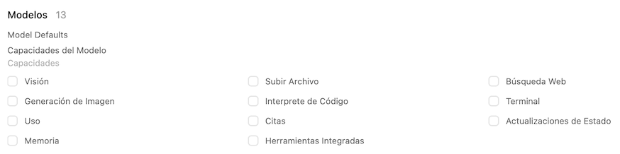
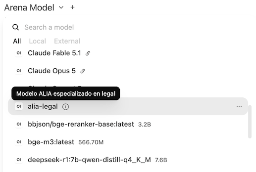

# Instalación

## Prerequisitos
### Podman: Instalación
Podman es el motor de contenedores oficial para RedHat 9 y 10 (y por consiguiente Oracle Linux 9 y 10). Ha sustituido al motor de Docker que se usaba en RedHat 7 y 8. 

Dependiendo de la distribución utilizada puede venir instalado, o deberás instalarlo con 

- Instalación completa: Podman + Buildah + Skopeo. Recomendada si vas a construir y publicar contenedores desde tu máquina
    ```shell
    sudo dnf module install container-tools
    ```
- Instalación mínima: Si sólo vas a ejecutar contenedores ya creados
    ```shell
    sudo dnf install podman
    ```

NOTA: Para otras distribuciones de Linux (soporta todas o casi todas) mira la página [Podman Installation](https://podman.io/docs/installation). Ten en cuenta

- Se requiere una versión de podman superior a 5.x para el soporte del acceso a GPU desde los contenedores.
- La configuración incluida aquí usa la aproximación rootless de systemd. Si tu distribución NO es systemd (seguro que sabes de Linux más que yo) deberás tenerlo en cuenta

### GPU

Para el uso de la GPU de NVIDIA en entorno Linux se decide instalar lo mínimo a nivel de host, dejando la instalación de CUDA como parte del contenedor. La razón de esta aproximación es que cada servicio probado dependendía de versiones de CUDA diferentes, y que además no eran parte de los repositorios básicos de Oracle Linux.

Por tanto, instalaremos los componentes mínimos, que son las siguientes:

#### [Driver con soporte a CUDA](https://docs.nvidia.com/datacenter/tesla/driver-installation-guide/latest/red-hat-enterprise-linux.html). IMPORTANTE: No instalamos CUDA completo, sólo el driver.
1. Instalamos el soporte de driver dinámico para el Kernel de NVIDIA (nvidia-dkms). Los siguientes son las instrucciones para Oracle Linux. Para tu distribución, busca NVIDIA OPEN DKMS.
    - Instalamos el paquete open dkms
        ```shell
        sudo dnf install -y kmod-nvidia-latest-dkms
        ```
    - Verificamos que se haya instalado correctamente. NOTA: Debe aparecer una línea por cada kernel que tengas configurado en tu sistema
        ```shell
        dkms status
        # Output
        # nvidia/610.57.04, 6.12.0-211.50.1.el10_2.x86_64, x86_64: installed
        ```
    - Opcional pero recomendado: Reiniciamos (`sudo reboot`) el sistema y tras arranque verificamos los módulos cargados
        ```shell
        lsmod | grep nvidia
        # **nvidia**_uvm           2449408  0
        # **nvidia**_drm            151552  4
        # **nvidia**_modeset       1818624  1 **nvidia**_drm
        # **nvidia**              105889792  2 **nvidia**_uvm,**nvidia**_modeset
        # drm_ttm_helper         16384  2 **nvidia**_drm
        # video                  81920  1 **nvidia**_modeset
        ```
2. Instalamos el driver de NVIDIA.
    ```shell
    sudo dnf install -y nvidia-driver-cuda
    ```
3. Opcional pero recomendado: Activamos el servicio de persistencia del driver en memoria. NOTA: Aumenta el consumo pero reduce la latencia.
    ```shell
    sudo systemctl enable --now nvidia-persistenced
    sudo systemctl start nvidia-persistenced
    sudo systemctl status nvidia-persistenced
    ```
4. Verificamos que el driver esté cargado
    ```shell
    nvidia-smi
    ```
#### Soporte para contendores: [NVIDIA Container Toolkit](https://github.com/NVIDIA/nvidia-container-toolkit)
1. Instalar el **tookit**
    ```shell
    # Install
    sudo dnf install -y \
        nvidia-container-toolkit \
        nvidia-container-toolkit-base
    # Check
    which nvidia-ctk
    nvidia-ctk --version
    ```
2. Generar el **interfaz** de contenedores. NOTA: Esto es muy dependendiente del sistema de contenedores que estés usando (podman, docker, rancher) y si lo estás usando rootless o no. Las instrucciones que incluyo aquí son las que he probado con podman rootless. Si tu caso es diferente, mira la documentación, que es bastante extensa y completa.
    - Generar el archivo de configuración. Durante la generación se producirán warnings sobre servicios que no quedan disponibles para contenedores. En nuestro caso sólo queremos usar el interfaz para IA, y sólo tengo una GPU. 
        ```shell
        sudo nvidia-ctk cdi generate --output=/etc/cdi/nvidia.yaml
        # Discared warnings
        # 1) Wayland / EGL warnings (server headless - no desktop)
        # 2) X11 warnings (server headless - no desktop)
        # 3) Vulkan warnings (server headless - no desktop - no gaming)
        # 4) Fabric manager: (Multiple / Datacenter fabrics)
        # 5) MPS service (Multiple HPC)
        # Check
        cat /etc/cdi/nvidia.yaml
        ```
    - Verificar que dispositivos se han generado (que son los que usaremos luego en los contenedores)
        ```shell
        sudo nvidia-ctk cdi list
        # INFO[0000] Found 3 CDI devices                          
        # nvidia.com/gpu=0
        # nvidia.com/gpu=GPU-a45fefa4-2cad-3003-b6a6-1464ac1a491a
        # nvidia.com/gpu=all
        ```
    - Autorizar el uso de los dispositivos GPU a los contenedores en SELinux
        ```shell
        sudo setsebool -P container_use_devices 1
        ```
    - Probar con un **contenedor básico CUDA** que tiene acceso a la tarjeta
        ```shell
        podman run --rm \
            --device nvidia.com/gpu=all \
            docker.io/nvidia/cuda:13.0.1-base-ubi9 \
            nvidia-smi
        ```
    - **ALTERNATIVA**: Si te sigue dando problemas de seguridad, **Y SÓLO PARA PROBAR**, se puede arrancar el contenedor sin etiquetado SELinux
        ```shell
        podman run --rm \
            --security-opt=label=disable \
            --device nvidia.com/gpu=all \
            docker.io/nvidia/cuda:13.0.1-base-ubi9 \
            nvidia-smi
        ```

## Podman: Configuración
### Reglas generales
- **Modo Rootless**: Los contenedores se desplegarán como servicios `systemd`de tu usuario. Sólo se dará acceso root cuando sea inevitable. Además se mantendrá activo el soporte de seguridad SELinux.
- **Registro**: Siempre que sea posible, se usará el registro de GitHub (`ghcr.io`). Como alternativa, tenemos el de docker `docker.io`o bien el registro privado que se despliegue a nivel de empresa. Siempre que sea posible, elegirmos imágenes multiplataforma (AMD64 y ARM64).
- **Versiones del contenedor**: Usaremos versiones fijas, evitando la etiqueta `latest`para tener un entorno reproducible. Es importante que estos productos despligan versiones muy habitualmente, por lo que se recomienda revisar las versiones desplegadas y actualizarlas. Para ello se puede utilizar este propio repositorio etiquetando el subdirectorio de contenedores con la versión probada en cada momento.
- **Comunicación entre contenedores**: La comunicación entre los contenedores se realizará en base al nombre de cada uno, usando el servicio DNS interno de Podman. Por tanto, es importante definir correctamente el atributo `ContainerName`de cada contenedor
- **Uso de SELinux**: Los contenedores se arrancarán con el soporte de seguridad SELinux activado. Por tanto, se usaran los permisos adecuados para cada contenedor. Específicamente, para montar los volúmenes se utilizará el sufijo `:Z` (por ejemplo, `Volume=$PODMAN_VOLUMES_AI/chromadb:/data:Z`)
- **Red**: Se define una red virtual por proyecto
### Configuración
- **Modo Rootless**: Al ser los contenedores servicios `systemd`de tu usuario, su configuración está ubicada en `$HOME/.config`. Específicamente, los [contenedores](./containers/systemd/) deberán ubicarse en `$HOME/.config/containers.systemd/`y la configuración de las [variables de entorno](./environment.d/) deberán ubicarse en `$HOME/.config/environment.d`.
- **Variables de entorno**: Se ha definido un archivo de configuración para las variables de entorno comunes a todo el proyecto en [ai.conf](./environment.d/ai.conf). NOTA IMPORTANTE: Usar este archivo es neceario al operar en modo persistente (Linger) puesto que en este caso los scripts habituales (.profile, .bashrc, ...) no se ejecutan al iniciar los contenedor.
- **Carga de imágenes**: La política de carga de imágenes esta definida como descarga del registro sólo si la imagen no está disponible (`Pull=missing`). Esto evita que entornos que actualizan la imagen manteniendo la etiqueta se recarguen. En su caso, siempre se puede parar el contenedor y borrar la imagen para forzar la recarga. De nuevo, el objetivo es tener un entorno estable y repetible.
- **Linger**: Por omisión, al ser servicios de usuario, estos no arrancan hasta que el usuario se conecta. Si deseas que estos servicios estén disponibles siempre, debes activar el linger para ese usuairo con
    ```shell
    sudo loginctl enable-linger NOMBRE_DE_USUARIO
    ```
### Uso básico
- **Despliegue**: Los contenedores en modo quadlet se despliegan regenerando su configuración cada vez que se modifica un archivo de contenedor u otra configuración (red, entorno). Para ello, se ejecuta (a nivel de usuario, sin `sudo`)
    ```bash
    systemctl --user daemon-reload
    ```
- **Errores de sintaxis**: Normalmente, el daemon-reload no indica los errores de sintaxis (simplemente no genera el servicio). En caso de que se produzcan, se debe corregir el archivo de configuración de contenedor correspondiente. Para identificar los errores de sintaxis siempre que se añada o modifique un archivo de contenedor.
    - **Dryrun**: Generar en vacío todos los contenedores. Si hay errores, lo indica
        ```shell
        # Dry-run generation of service files
        /usr/lib/systemd/system-generators/podman-system-generator --user --dryrun
        ```
    - **Verificar** un servicio concreto (ideal para scripts DevOps) 
        ```shell
        # Verify a specific service. If is not generated or error, return error. Else nothing
        systemd-analyze --user --generators=true verify your_container_file_name.service
        ```
- **Gestión de los servicios**: La gestión es la habitual de systemd, indicando el modo `--user`. IMPORTANTE: Los servicios los desplegamos con dependencias entre ellos. Tengase en cuanta que parar un servicio requerido por otro, finaliza ambos.
    - **Iniciar**: `systemctl --user start your_container_file_name.service`
    - **Parar**: `systemctl --user stop your_container_file_name.service`
    - **Reiniciar**: `systemctl --user restart your_container_file_name.service`
    - **Estado**: `systemctl --user status your_container_file_name.service`
- **Reinicio del modo rootless**: A veces se puede caer o corromper todo el modo rootless del usuario. Para resetear el servicio de usuario
    ```shell
    sudo systemctl restart user@$(id -u).service
    ```

## Red de contenedores
- Se ha definido una red para este proyecto que se llama `ai`que se encuentra definida en [ai.conf](./containers/systemd/ai.network)
- No se ha fijado rango de IPs ni gateway para la red (están las líneas comentadas en el archivo)
- Todos los contenedores del proyecto corren en es red: Atributo `Network=ai`a nivel de contenedor
- Los contenedores **NO** fijan una dirección IP: Atributo comentado `# IP=x.x.x.x`a nivel de contenedor. Si se quisiera definir, debe definirse previamente el rango en el archivo de red, y la IP asignada debe pertenecer a este rango.

## Motor de inferencia: Ollama
- La configuración del quadlet debe copiarse en `~/.config/containers/systemd/ollama.container`. **Se debe modificar la ubicación de los directorios de datos y temporal** a la ubicación correcta, según se indica en Volúmenes.
- Configuración del contenedor [ollama.container](./containers/systemd/ollama.container)
    - **Imagen:** Ollama no publica sus contenedores en GHRC, por lo que la alternativa es usar el repositorio de docker o bien imágenes de la comunidad. En este caso se usan el registro de docker. Se utiliza la versión 0.34.0 para CUDA. `Image=docker.io/ollama/ollama:0.34.0`
    - **Dispositivo**: Debe incluirse el dispositivo con el atributo `AddDevice` apuntando a la GPU declarada en el NVIDIA Container Toolkit (ver más arriba)
        ```ini
        # NVIDIA GPU Device
        AddDevice=nvidia.com/gpu=all
        ```
    - **Puertos**: Se utiliza el puerto 11434 para el servicio de ollama. En principio, si sólo va a acceder OpenWebUI no es necesarios publicar el puerto, pero otros laboratorios comparten el servicio, por lo que el puerto está publicado a nivel de todas las interfaces del host (`PublishPort=11434:11434`). Se puede acceder a la web de ollama con `http://localhost:11434/`
    - **Volúmenes**: Este contenedor usa un directorio para toda la configuración de ollama (incluyendo modelos, que ocupan mucho espacio) y otro para el directorio temporal. En este archivo, se asume que los volúmenes están definidos en `/vm/ai/ollama` propiedad del usuario que ejecuta los servicios
        - Creamos los directorios usando el usuario local. **Sustituir `/vm/ai/ollama`por tu ubicación de datos**
            ```shell
            mkdir -p /vm/ai/ollama/.ollama
            mkdir -p /vm/ai/ollama/.tmp
            ```
        - Configuración de los volúmenes (nótese el :Z para el soporte de SELinux). **Sustituir `/vm/ai/ollama`por tu ubicación de datos**
            ```container
            Volume=/vm/ai/ollama/.ollama:/root/.ollama:Z
            Volume=/vm/ai/ollama/.tmp:/tmp:Z
            ```
    - **Entorno**: El propio ollama se configura usando variables de entorno. Explicar todas estas variables está fuera de esté ámbito, y además parece ser que no hay una documentación oficial con todas las variavbles. Puedes revisar es recopilación independiente [aquí](https://modelpiper.com/blog/ollama-environment-variables). Para maximizar las capacidades de mi tarjeta (pequeña) estoy asumiendo un sólo usuario, sin tareas en paralelo (sin agentes), y sin multimodelo (descarga automática de modelos a los 5 minutos)

        ```container
        Environment=OLLAMA_HOST=0.0.0.0:11434
        Environment=OLLAMA_NUM_PARALLEL=1
        Environment=OLLAMA_MAX_LOADED_MODELS=1
        Environment=OLLAMA_KEEP_ALIVE=5m
        # Context size. Optimization for reduce memory optimization
        Environment=OLLAMA_CONTEXT_LENGTH=8192
        ```
    - **Memoria compartida**: Es importante aumentar el tamaño de la memoria compartida para el intercambio de datos entre la CPU y la GPU. Es imprescindible si quieres probar modelos grandes (de tipo MoE) que obliguen a cargar y descargar los 'expertos' a la GPU
        ```container
        ShmSize=1g
        ```
- Pruebas mínimas: En la versión de contenedor de ollama, podríamos usar el cliente invocando directamente al contenedor, Peor como lo vamos a conectar mediante API Rest, lo correcto es verificar esta. NOTA: Recuerda que Ollama ahora soporta su API nativa y la API compatible con OpenAI
    - Cargar un modelo (API)
        ```shell
        curl http://localhost:11434/api/pull -d '{
            "name": "gemma2"
            }'
        ```
    - Cargar un modelo (comando)
        ```shell
        podman exec -it ollama ollama pull qwen3.5-4b
        ```
    - Listar los modelos cargados (API)
        ```shell
        # Native API
        curl http://localhost:11434/api/tags
        # OpenAI API
        curl -X GET http://localhost:11434/v1/models
        ```
    - Listar los modelos cargados (comando)
        ```shell
        podman exec -it ollama ollama list
        ```
    - Pregunta simple (API)
        ```shell
        curl http://localhost:11434/api/generate -d '{
            "model": "gemma2",
            "prompt": "¿Por qué el cielo es azul?",
            "stream": false
            }'
        ```
    - Pregunta simple (comando)
        ```shell
        podman exec -it ollama ollama run gemma2 "¿Por qué el cielo es azul?"
        ```
    - Borrar un modelo (API)
        ```shell
        curl -X DELETE http://localhost:11434/api/delete -d '{
            "name": "gemma2"}'
        ```
    - Borrar un modelo (comando)
        ```shell
        podman exec -it ollama ollama rm gemma2
        ```
- Monitorización: Si la instalación es correcta, ollama ejecutará sus modelos en la GPU de NVIDIA a través del ctk. Se puede monitorizar el uso de la GPU en el host con:
    ```shell
    nvidia-smi -l 2
    # Check processes line
    #   GPU   GI   CI              PID   Type   Process name                        GPU Memory 
    #     0   N/A  N/A         1611228      C   /usr/lib/ollama/llama-server           4572MiB
    #  Check type: C (Container)
    #  Check memory: Initially, the model size. It will increase with KVCache consumption  
    ```
- **PENDIENTE**: Configurar para ejecute el modelo en la GPU pero mantenga el KVCache en la memoria de la CPU

## Framework AI: Open WebUI
- La configuración del quadlet debe copiarse en `~/.config/containers/systemd/open-webui.container`. **Se debe modificar la ubicación de los directorios de datos y temporal** a la ubicación correcta, según se indica en Volúmenes, la clave `WEBUI_SECRET_KEY` y el nombre de dominio para la verificación CORS si se planea usar un reverse proxy securizado.
- Configuración del contenedor [open-webui.container](./containers/systemd/open-webui.container)
    - **Dependencias**: El servicio debe esperar a qué `ollama`haya arrancado. Esto se define en la sección `[Init]`del qualet. NOTA: Con este configuración, la parada o rearranque de `ollama`forzará la parada o reinicio de este contenedor
        ```ini
        [Unit]
        Description=Open WebUI
        After=ollama.service
        Requires=ollama.service
        ```
    - **Imagen**: Se utiliza la versión 0.11.1 del repositorio GHCR. `Image=ghcr.io/open-webui/open-webui:v0.11.1`. He comprobado que cuando se cambia la imagen se ejecutan automáticamente los scripts de actualización de la base de datos, pero recuerda hacer copia de seguridad del directorio de datos cada vez que modifiques la versión.
    - **Puertos**: El contenedor utiliza internamente el puerto 3000 que vamos a publicar al 8080 para este servicio. En principio, si sólo va a acceder OpenWebUI no es necesarios publicar el puerto, pero otros laboratorios comparten el servicio, por lo que el puerto está publicado a nivel de todas las interfaces del host (`PublishPort=3000:8080`). Se puede acceder a la web de ollama con `http://localhost:8080/`. NOTA: En mi caso, este servidor está publicado en un reverse proxy montado con apache, lo que tiene algún efecto en la configuración según se indica en las variables de entorno.
    - **Volúmenes**: Este contenedor usa un directorio para toda la configuración de Open WebUI **y de sus herramientas** (incluyendo la base de datos vectorial y los archivos de documentos). En este archivo, se asume que el volumen de datos está definidos en `/vm/ai/open-webui/data` propiedad del usuario que ejecuta los servicios
        - Creamos el directorio usando el usuario local. **Sustituir `/vm/ai/open-webui/data`por tu ubicación de datos**
            ```shell
            mkdir -p /vm/ai/open-webui/data
            ```
        - Configuración de los volúmenes (nótese el :Z para el soporte de SELinux). **Sustituir `/vm/ai/open-webui/data` por tu ubicación de datos**
            ```container
            Volume=/vm/ai/open-webui/data:/app/backend/data:Z
            ```
        - Este directorio debe tener copia de seguridad. La configuración inicial (gestionada por Open WebUI - no se debe hacer nada inicialmente) incluye
            - Archivos `webui.db*`: Base de datos SQLite utilizada por Open WebUI. Documentación [aquí](https://docs.openwebui.com/reference/database-schema)
            - Directorio `vector_db`: Base de datos vectorial utilizada por Open WebUI (Chroma) internamente (es posible definir una externa)
            - Directorio `uploads`: Archivos subidos por el usuario para la base de datos vectorial
            - Directorio `cache`: Diferentes chases según operativa y modelo
    - **Entorno**:
        - **Obligatorio**: Ubicación del servidor ollama: **NO** hace falta modificarlo si se mantiene la configuración del quadlet del punto anterior `Environment=OLLAMA_BASE_URL=http://ollama:11434`. Sin esta variable Open WebUI se puede usar pero únicamente con servicios Cloud
        - **Opcional**: Por defecto, cuando arranca Open WebUI por primera vez, pide el usuario y password del usuario administrador y queda configurado en modo multiusuario. Si se va a usar en modo individual (un único usuario y siempre el mismo) se puede desactivar la gestion de usuarios `Environment=WEBUI_AUTH=False`.
        - **Opcional/Dependencia**: Si se usan usuarios independientes y/o multiples servidores en balanceo de carga, se necesita crear una clave de firma de los tokens JWT. En el terminal ejecuta `openssl rand -base64 32` para generar una clave aleatoria y asígnala a Environment=WEBUI_SECRET_KEY=<SetHerea32characterKeyInHex>. El detalle de la documentación [aquí](https://docs.openwebui.com/getting-started/advanced-topics/hardening/#secret-key)
        - **Opcional/Recomendado**: Si vas a utilizar Open WebUI para RAG (siguiente caso de uso) se recomienda establecer la variable`Environment=RAG_SYSTEM_CONTEXT=True`. El detalle del porqué de la recomendación [aquí](https://docs.openwebui.com/troubleshooting/rag/#8-slow-follow-up-responses-kv-cache-invalidation)
        - **Opcional/Dependencia**: Si se configura un Reverse Proxy, se debe indicar el nombre del dominio de acceso a Open WebUI en `Environment=CORS_ALLOW_ORIGIN=https://open-webui.example.com`
        - **Opcional**: Si se van a utilizar tools que accedan a internet, se puede configurar el User-Agent a utilizar `Environment=USER_AGENT=OpenWebUI-OracleLinux-Lab`
    - **Adicional**: Puesto que este contenedor puede ejecutar tools de forma arbitraria, se añade esta opción de configuración, para evitar el escalado de privilegios mediante setsuid. `NoNewPrivileges=true`
## Base de datos vectorial para RAG: Chroma
## Servicio de búsqueda: SearxNG
# Casos de uso
## Framework AI: Open WebUI

### 0. Configuración inicial
- **Capacidades de los modelos**
    - **Configuración Global**: Se accede mediente Panel de Administración $\rightarrow$ Settings $rightarrow$ Models $\rightarrow$ Model Defaults $\rightarrow$ Configure. La recomendación inicial, si se van a probar múltiples modelos es **desactivar** todas las capacidades, y luego activarlas modelo a modelo. Durante las pruebas iniciales se observaron comportamientos extraños y **no repetibles** por tener activadas capacidades como las herramientas o la memoria. 

    - **Configuración individual**: La configuración de cada modelo se hace definiendo modelos personalizados en la sección de Area de trabajo o Workspace. Para cada modelo, se pueden crear múltiples configuraciones con nombres diferentes, descripción y capacidades, lo que permite usar el mismo modelo con diferentes capacidades. Documentación [aquí](https://docs.openwebui.com/features/workspace/models/). Del mismo modo, se pueden ajustar los hiperparámetros para cada prueba.
    - **NOTA**: Esto mismo se puede hacer de forma puntual, para una sola prueba, en el panel de la derecha. **NO** se recomienda, porque es muy fácil olvidar qué parámetro se puso para cada prueba.

### 1. Chat simple

- **Selección del modelo**: El primer punto para empezar a usar Open Web en modo conversación es seleccionar el modelo. En este nivel, la pregunta es contestada por un modelo concreto, o bien se puede enviar a varios modelos simultáneamente para hacer un benchmark. La lista desplegable muestra los modelos disponibles, en 3 categorías

    1. Modelo local servido por ollama
    2. Modelo en la nube (debes haber registrado tus claves en 'conexiones'). Indicado por el símbolo 🔗
    3. Modelo personalizado, creado en la sección `Area de trabajo / Workspace` indicando las capacidades a usar de un modelo genérico. Indicado por el símbolo ⓘ. En este caso, un tooltip mostrará la descripción del modelo.

    - NOTA: Los modelos que aparecen en la lista se pueden habilitar o deshabilitar en la configuración global.

    Si se desea hacer una comparativa, se puede usar el modelo Arena, o bien añadir varios modelos con el símbolo '+'. **IMPORTANTE**: Se debe recordar que en la infraestructura actual sólo cabe un modelo, lo que obliga a ollama a descargar un modelo para cargar el otro, lo que conlleva bastante tiempo. Por tanto, la recomendación es hacer todas las pruebas con un modelo antes de pasar a otro

    

- **Manejo de la conversación**: Open WebUI funciona como los chats de los modelos de nube, esto es, mantiene la conversación mientras no seleccionemos nuevo chat. Recordemos que en la configuración del contenedor hemos fijado un tamaño de contexto pequeño (que se puede ampliar según la prueba a hacer). O sea, no se usa la capacidad declarada del modelo, sino lo configurado en el contenedor. Además, todos los chats anteriores están disponibles en la sección izquierda del interfase.

- **Resultado de la pregunta**: A diferencia de los chats habituales, y teniendo en cuenta que se manejan capacidades RAG, búsqueda y herramientas, la sección de respuesta puede incluir varios apartados que inicialmente están colapsados, pero se pueden abrir. Estos apartados son, entre otros:
    - Planificación / proceso de razonamiento (cuando el modelo soporte razonamiento y esté activado)
    - Resultados de la consulta RAG (ya rerankeada). Ver en el caso siguiente como probar el RAG.
    - Resultados de la búsqueda en la Web
    - Respuesta al chat
    - Opciones de seguimiento (con posibilidad de click directo)

- **Ajuste de capacidades**: PENDIENTE - modelos custom

### 2. RAG simple (con uso de RAG interno)
### 3. Búsqueda Web
### 4. Razonamiento / tooling / MCP

# Anexo: Modelos utilizados

## ¿Cómo selecciono el modelo?
Para seleccionar un modelo debemos tener en cuenta varios factores, entre los que destacan

- El uso deseado (chat básico, codificación, chat avanazado con búsqueda y razonamiento, embedding, reranking ...)
- El tamaño del modelo a utilizar, que se divide en
    - Número de parámetros
    - Quantización
    - Tipo de cuantización / Arquitectura de cuantización 
- Formato de archivo: Para su uso en local, el estándar es [GGUF](https://huggingface.co/docs/hub/gguf), sobre todo si vas a querer probar varios modelos cargando y descargando
- La arquitectura del modelo. Si queremos usar modelos grandes, podemos usar arquitecturas MoE (mixture-of-experts) que cargan el experto necesario, pero no necesitan cargar todo el modelo. 
- La especialidad: Hay modelos especializados en embedding, en reranking, etc.
- Las capacidades del modelo: Específicamente si tiene la capacidad de tooling y la capacidad de thinking (cuidado, hay modelos que soportan razonamiento pero hay que activarlo o desactivarlo a demanda)
- Las capacidades de la GPU

## No encuentro el modelo que quiero probar en el formato deseado

Cada vez más es posible encontrar los modelos ya preparados para su uso en local, incluyendo la cuantización a 4bits. Pero si se necesita o desea, es una tarea que se puede hacer localmente, en dos pasos: Conversión a GGUF y cuantización. [How to Convert a Hugging Face Model to GGUF and Quantize It](https://ai-tldr.dev/learn/local-open-models/quantization-and-formats/convert-hf-model-to-gguf/). Una vez convertido debe desplegarse en Ollama creando un modelo custom a través de un fichero [Modelfile](https://docs.ollama.com/import#importing-a-gguf-based-model-or-adapter)

## Modelos utilizados en este laboratorio (en GPU de 6GB VRAM)

Estos son los modelos que estoy probando en el laboratorio, ordenados de mayor a menor prioridad, por tipo de uso.

Recordad que los modelos chinos **NO** se publican directamente en Hugging Face y/o se publican tarde. En estos casos el enlace apunta a la implementación de un contribuidor individual. En estos casos, el enlace incluido os lleva a la página de búsqueda de Hugging Face.

Por otro lado, `ollama` puede descargar modelos de Hugging Face directamente, pero también mantiene su propia biblioteca. En mi caso, prefiero este segundo origen siempre que se pueda, porque al menos están probadas.

### General chat
- [Qwen3.5-4B](https://huggingface.co/Qwen/Qwen3.5-4B): 3,4GB `podman exec -it ollama ollama pull qwen3.5:4b` 
- [Gemma 3 4B IT](https://huggingface.co/google/gemma-3-4b-it): 3,3GB `podman exec -it ollama ollama pull  gemma3:4b`
- [Phi-4-mini-instruct](https://huggingface.co/microsoft/Phi-4-mini-instruct): 2,5 GB `podman exec -it ollama ollama pull  phi4-mini`
- Otros: Llama 3.2 3B, Qwen 3 (versión anterior de mucho éxito)

### Código
- [Qwen3.5-4B](https://huggingface.co/Qwen/Qwen3.5-4B): 3,4GB `podman exec -it ollama ollama pull qwen3.5:4b` 
- [Qwen3-4B](https://huggingface.co/Qwen/Qwen3-4B): 2,5 GB `podman exec -it ollama ollama pull qwen3:4b` El primer Qwen3, que tuvo mucho éxito
- [Phi-4-mini-instruct](https://huggingface.co/microsoft/Phi-4-mini-instruct): 2,5 GB `podman exec -it ollama ollama pull  phi4-mini`
- [qwen2.5-coder:3b](https://huggingface.co/Qwen/Qwen2.5-Coder-3B-Instruct-GGUF): 1,9GB. `podman exec -it ollama ollama pull qwen2.5-coder:3b` Más antiguo, pero sigue siendo utilizado por su ligereza
- [Qwen3-Coder-30B-A3B Q4](https://huggingface.co/Qwen/Qwen3-Coder-30B-A3B-Instruct): Experimental. No entra por tamaño, pero es MoE experto a experto sí
- Otros: deepseek-coder:6.7b (probablemente en Q4), `qwen3.6:35b-a3b-coding-nvfp4`

NOTA: **PENDIENTE DE ACTUALIZAR** Ejecutar Claude con ollama `ollama launch claude --model qwen3.6:35b-a3b-coding-nvfp4`

### Razonamiento
- [Qwen3.5-4B](https://huggingface.co/Qwen/Qwen3.5-4B): 3,4GB `podman exec -it ollama ollama pull qwen3.5:4b` 
- [Qwen3-8B Q4](https://huggingface.co/Qwen/Qwen3-8B): 5,2 GB `podman exec -it ollama ollama pull qwen3:8b-q4_K_M` 
- [DeepSeek-R1-Distill-Qwen-7B Q4](https://huggingface.co/deepseek-ai/DeepSeek-R1-Distill-Qwen-7B): 4,7 GB`podman exec -it ollama ollama pull deepseek-r1:7b-qwen-distill-q4_K_M`
- [Phi-4-mini-instruct](https://huggingface.co/microsoft/Phi-4-mini-instruct): 2,5 GB `podman exec -it ollama ollama pull  phi4-mini`
- [Qwen3-4B](https://huggingface.co/Qwen/Qwen3-4B): 2,5 GB `podman exec -it ollama ollama pull qwen3:4b` 


### Embeddings
- [BAAI/bge-m3](https://huggingface.co/BAAI/bge-m3): 1,2GB `podman exec -it ollama ollama pull bge-m3` Recomendado para embeddings en español
- [nomic-embed-text-v1.5](https://huggingface.co/nomic-ai/nomic-embed-text-v1.5) : 0,3GB `podman exec -it ollama ollama pull nomic-embed-text:v1.5`
- Otros: bge-small, bge-base`

### Reranking
- [BAAI/bge-reranker-base](): 2,0GB `podman exec -it ollama ollama pull bbjson/bge-reranker-base`. Inicial
- [BAAI/bge-reranker-v2-m3](https://huggingface.co/BAAI/bge-reranker-v2-m3): 0,6GB `podman exec -it ollama ollama pull qllama/bge-reranker-v2-m3` Español, más moderno, más pesado. La versión incluida es la cuantizada a 8bits, pero están disponibles la cuantizada a 4bits, y la nativa f16
- [jina-reranker-v2-base-multilingual](https://huggingface.co/jinaai/jina-reranker-v2-base-multilingual): Español. Más pesado. No disponible en el repositorio de ollama, requiere el proceso de conversión y despliegue comentado más arriba, o bien buscar una versión de un contribuidor individual.

### Modelos españoles (haciendo patria)
- [Salamandra-7b-instruct-2606-GGUF](https://huggingface.co/KikoCis/salamandra-7b-instruct-2606-GGUF): Disponible con cuantizados del Q3 al Q8. La versión de ollama es Q4_K_M. 4,9GB `podman exec -it ollama ollama pull hdnh2006/salamandra-7b-instruct`
- [Aitana-7B-S-Instruct](https://huggingface.co/gplsi/Aitana-7B-S-Instruct). Para el uso con ollama requiere importarlo mediante Modelfile (ya existe la versión GGUF, con lo que la importación es trivial)
